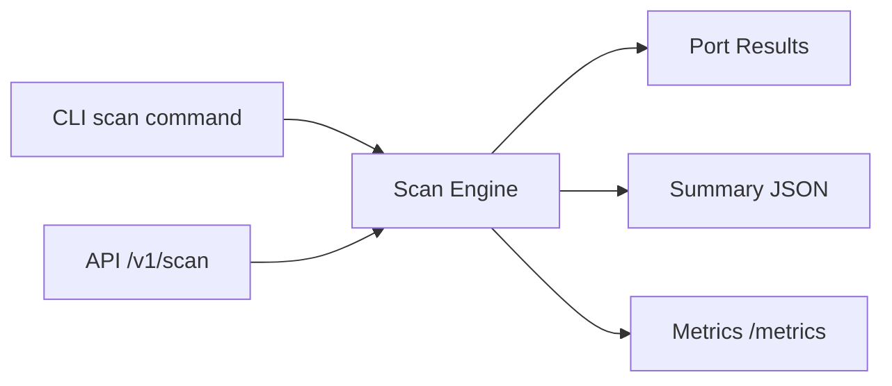

# SniperScan

High-concurrency TCP reconnaissance scanner in Go with API mode and metrics.

## Why this repo matters
SniperScan demonstrates production-style scanning primitives for security engineering:
- deterministic port target parsing and bounded concurrency
- low-latency TCP probing and optional banner fingerprinting
- JSON outputs for automation and reporting
- API service mode for integration into larger platforms

## Architecture


## Quick start
### CLI scan
```bash
go run ./cmd/sniperscan scan --target 127.0.0.1 --ports 22,80,443
```

### API mode
```bash
go run ./cmd/sniperscan serve --addr :8097
```

Endpoints:
- `GET /healthz`
- `POST /v1/scan`
- `GET /metrics`

Example API request:
```bash
curl -s -X POST http://localhost:8097/v1/scan \
  -H 'Content-Type: application/json' \
  -d '{"target":"127.0.0.1","ports":"22,80,443","timeout_ms":300,"concurrency":100,"banner":true}' | jq
```

### Docker stack
```bash
make docker-up
```

Services:
- SniperScan API: `http://localhost:8097`
- Prometheus: `http://localhost:9097`

## Testing
```bash
make test
```

## Security
- Policy: `SECURITY.md`
- Threat model: `docs/THREAT_MODEL.md`

## Legacy
Original Windows/C++ implementation is preserved in `legacy/windows-v1/`.
