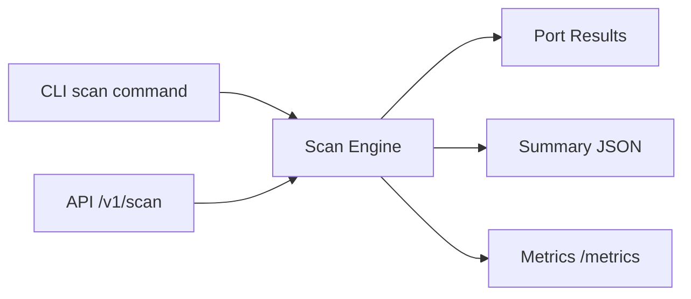

# SniperScan Architecture

## Components
- Port parser: deterministic expansion of user port specs.
- Scan engine: high-concurrency TCP dial workers with timeout control.
- Fingerprint layer: lightweight service hints from port + banner.
- API service: endpoint for remote orchestration and report export.
- Metrics: Prometheus counters for scans and discovered open ports.

## Data flow

